# AEP Training 1
Basics about Separation of Concern and the Apex Enterprise Patterns

## Contents

- [Separation of Concern](#separation-of-concern)
    - [Domain](#domain)
    - [Selector](#selector)
    - [Service](#service)
- [Hands on session](#hands-on-session)
    - [The user story](#the-user-story)
    - [Write the feature test](#feature-test)
    - [Implement the high level business logic](#implement-the-high-level-business-logic)
        - [Creation of Service Layer](#create-service-layer-logic-for-accounts)
        - [Create Implementation of Service Layer](#create-implementation)
        - [Write high level business logic](#write-high-level-business-logic)
    - [Implement low level business logic](#implement-low-level-business-logic)
        - [Create Accounts domain implementation](#create-accounts-domain-implementation)
        - [Create Contacts domain implementation](#create-contacts-domain-implementation)
        - [Create Contacts selector implementation](#create-contacts-selector-implementation)
    - [Add business logic trigger points](#add-business-logic-trigger-points)
        - [Create Trigger](#create-trigger)
    - [Refactoring](#refactoring)
- [Resources](#resources)
    

## Separation of Concern

### Domain
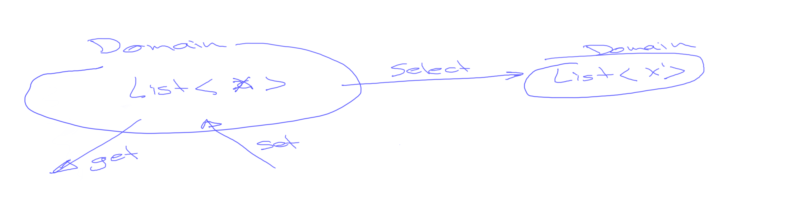
The domain is a wrapper around a list of objects and contains methods to;

- *Getters* - Retrieve information for the objects inside the domain
- *Setters* - Change data on the objects in the domain
- *Selectors* - Select a subset of records based on criteria

**IMPORTANT**

The domain should not be aware of any other class or object besides itself.
Object inside the list contained by the domain can change, 
but the list will always contain the same objects.

**Example methods**
```apex
// returns a list with all the Account names of the objects in the domain
List<String> getAccountNames();

// changes the ShippingCountry on all objects in the domain to the provided value
void setShippingCountry(String countryName);          

// create a new instance of the same domain but only with those objects matching the provided value for ShippingCountry
Accounts selectByShippingCountry(String countryName); 

// returns a set of all the object Ids 
Set<Id> getRecordIds();
```

### Selector
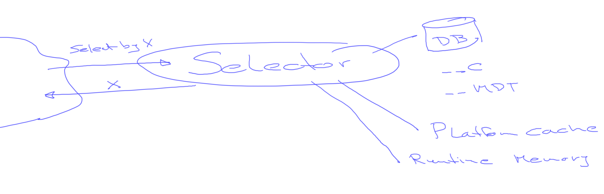
The purpose of the selector is to retrieve data from a source and return it.
The source can be a;
 
- Database; __c, __mdt, etc
- Platform cache
- Runtime memory
  
**IMPORTANT**

selector methods always accept arguments in bulk. The arguments are typically primitive variables in lists or sets.  
  
**Example methods**
```apex
// returns a list of Account objects where the shipping country is in the provided list
List<Account> selectByShippingCountry(Set<String> countryNames);
``` 

### Service
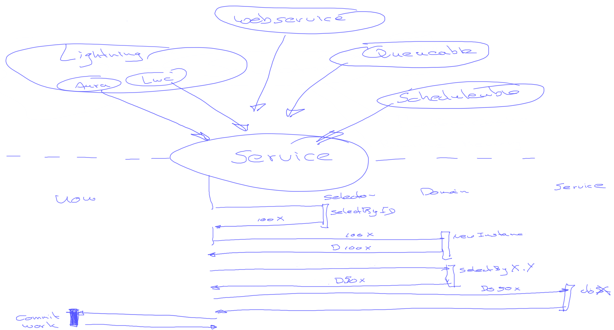
The service layer contain the high level business logic. 
It is a shared point of execution for the logic. 


**IMPORTANT**

Use method overloading to enable different parts of the source to call the same logic,
even when they do not have the same set of information available, e.g.; Records VS RecordIds

**Example methods**
```apex
void doSomething(Set<Id> idSet);
void doSomething(List<Account> records);
void doSomething(Accounts accounts);
void doSomething(fflib_ISObjectUnitOfWork unitOfWork, Accounts accounts);
```  

# Hands on Session
This training will take you step by step through a simple user story. 
It shows you how to develop that using the Separation of Concerns principle 
with the Apex Enterprise Patterns.

The described user story is very simple, 
in fact it is so simple that you can resolve it without writing code.
But for the sake of this training we will use code. 

## The User story 

    GIVEN an account with contact records
    WHEN the ShippingCountry is changing on the account record
    THEN the country should be copied to the MailingCountry field on all the child contacts of that account

## Feature test 
In this training we will develop our code using the Test Driven Development principles. 
The benefit of this is that you always know where you need to continue if you left off for a cup of coffee
or suddenly end up in a long discussion with a colleague.
You just run the test and voilà.
It will guarantee you that you have a very high code coverage
and will have it very easy when you ever have to do some refactoring. 

Let's create our feature test class file `AccountFeatureTest`.

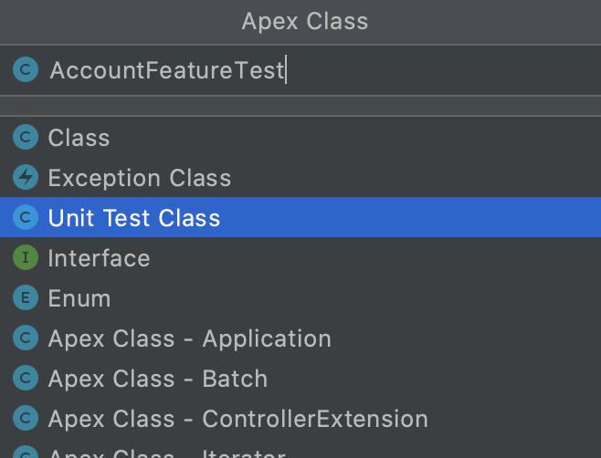

```apex
@IsTest
private class AccountFeatureTest
{
    @IsTest
    static void testBehavior()
    {
//      GIVEN an account with contact records
//      WHEN the ShippingCountry is changing on the account record
//      THEN the country should be copied to the MailingCountry field on all the child contacts of that account
    }
}
```

### Let's create our test data
>  :sparkles: Use Live-Template: **new** for new variable, **nl** for new list and **n** for new object
```apex
// GIVEN an account with contact records
Account account = new Account(Name = 'Test');
insert account;

List<Contact> contacts = new List<Contact>
{
        new Contact(LastName = 'John', AccountId = account.Id),
        new Contact(LastName = 'Jack', AccountId = account.Id),
        new Contact(LastName = 'Jill', AccountId = account.Id)
};
insert contacts;
```

### Write the test execution
>  :sparkles: Use Live-Template: **st** for start & stop test

>  :sparkles: Use Camel-Case typing:  SC => ShippingCountry

```apex
//  WHEN the ShippingCountry is changing on the account record
System.Test.startTest();
account.ShippingCountry = 'Holland';
update account;		
System.Test.stopTest();
```
Always embed the test execution inside a startTest and stopTest
to make sure the limits are checked in a proper manner.

### Do the Assertions

>  :sparkles: Use Live-Template: **sqv** to create the SOQL statement to a List

>  :sparkles: Use Live-Template: **sa** for System.assert(...)

>  :sparkles: Use Live-Template: **sae** for System.assertEquals( expected, actual, message)

>  :sparkles: Use Live-Template: **iter** to create a for loop

```apex
// THEN the country should be copied to the MailingCountry field on all the child contacts of that account
List<Contact> results = [SELECT MailingCountry FROM Contact WHERE AccountId=:account.Id];
System.assert(results.size() == 3);
for (Contact result : results)
{
    System.assertEquals('Holland', result.MailingCountry, 'Whoops country not updated');
}
```

**IMPORTANT**
- Always validate that you have the right amount of records.
- Add assertion messages where useful

### Do some Refactoring
- String 'Holland' appears twice, prone to typos. Refactor to static constant. :sparkles: use Live-Template **ALT + CMD + C**

### Run the test

:tada: Whoohoo, we have ourselves a failing test and some work to do.

```apex
@IsTest
private class AccountFeatureTest
{
    private static final String HOLLAND = 'Holland';

    @IsTest
    static void testBehavior()
    {
//      GIVEN an account with contact records
        Account account = new Account(Name = 'Test');
        insert account;

        List<Contact> contacts = new List<Contact>
        {
                new Contact(LastName = 'John', AccountId = account.Id),
                new Contact(LastName = 'Jack', AccountId = account.Id),
                new Contact(LastName = 'Jill', AccountId = account.Id)
        };
        insert contacts;

//      WHEN the ShippingCountry is changing on the account record
        System.Test.startTest();
        account.ShippingCountry = HOLLAND;
        update account;
        System.Test.stopTest();

//      THEN the country should be copied to the MailingCountry field on all the child contacts of that account
        List<Contact> results = [SELECT MailingCountry FROM Contact WHERE AccountId=:account.Id];
        System.assert(results.size() == 3);
        for (Contact result : results)
        {
            System.assertEquals(HOLLAND, result.MailingCountry, 'Whoops country not updated');
        }
    }
}
```


## Implement the high level Business logic
Now we have to look at the user story again
and try to understand what the high level business logic is.

     GIVEN an account with contact records
     WHEN the ShippingCountry is changing on the account record
     THEN the country should be copied to the MailingCountry field on all the child contacts of that account

The high level logic is usually contained in the **THEN** part of the user story.

In this case we primarily have Account records, 
so we should create a method on the Service layer for Accounts; `AccountsService`

### Create Service Layer logic for Accounts

Now we can create a new Interface for AccountsService methods named `AccountsService`
and think of a proper name for this business logic, e.g.; `copyShippingCountryToContacts`
<div>
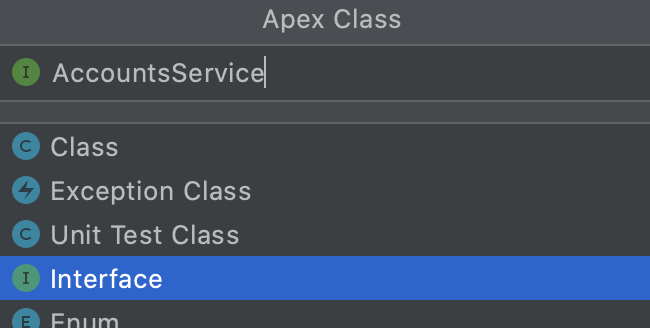
</div>

As we define the method we use method overloading to create multiple entry point for the logic.
In that manner different points in our source code can call this logic with slightly different arguments,

> Sometimes methods already have the records, others only have their Ids. Use method overloading to resolve this.

```apex
public interface AccountsService
{
	void copyShippingCountryToContacts(Set<Id> idSet);
	void copyShippingCountryToContacts(List<Account> records);
	void copyShippingCountryToContacts(Accounts accounts);
	void copyShippingCountryToContacts(fflib_ISObjectUnitOfWork unitOfWork, Accounts accounts);
}
```

We typically create these multiple entry points;
- Set of key identifiers e.g.; Ids
- List of the objects or records;  `List< x >`
- A domain class with a list of objects
- A domain and unitOfWork. Useful when the business logic is part of a bigger context with a single commit to the database. 


#### Resolve issues

The domain class `Accounts` is missing, 
lets create one by setting the pointer on the `Accounts` reference that highlights in red 
and click ALT+ENTER then select "create Interface".
We leave that class empty for now and come back to that later.

Save and push everything to your Scratch Org.

### Create implementation
Now we are ready to write the actual high level business logic in code.
Let create an implementation for the Accounts Service Layer named `AccountsServiceImp`.

<div>
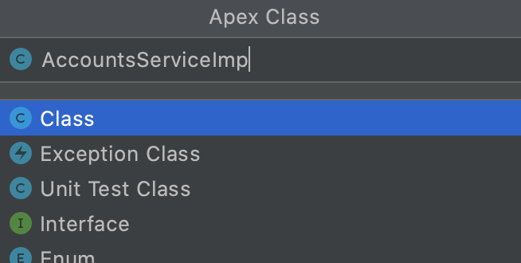
</div>

```apex
public with sharing class AccountsServiceImp implements AccountsService
{
}
```

**Create method implementations**
>  :sparkles: Use short-key  CTRL + I 
<div>
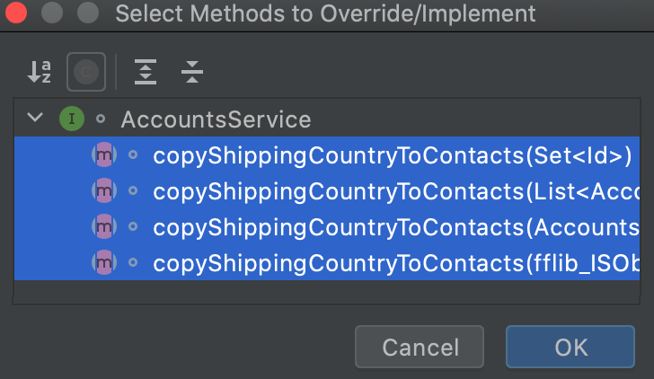
</div>


```apex
public with sharing class AccountsServiceImp implements AccountsService
{
    public void copyShippingCountryToContacts(Set<Id> idSet)
    {
    }

    public void copyShippingCountryToContacts(List<Account> records)
    {
    }

    public void copyShippingCountryToContacts(Accounts accounts)
    {
    }

    public void copyShippingCountryToContacts(fflib_ISObjectUnitOfWork unitOfWork, Accounts accounts)
    {
    }
}
```

**Write method overloads**
```apex
public with sharing class AccountsServiceImp implements AccountsService
{
    public void copyShippingCountryToContacts(Set<Id> idSet)
    {
        copyShippingCountryToContacts(
                (Accounts) Application.Domain.newInstance(idSet)
        );
    }

    public void copyShippingCountryToContacts(List<Account> records)
    {
        copyShippingCountryToContacts(
                (Accounts) Application.Domain.newInstance(records)
        );
    }

    public void copyShippingCountryToContacts(Accounts accounts)
    {
        fflib_ISObjectUnitOfWork unitOfWork = Application.UnitOfWork.newInstance();
        copyShippingCountryToContacts(unitOfWork, accounts);
        unitOfWork.commitWork();
    }

    public void copyShippingCountryToContacts(fflib_ISObjectUnitOfWork unitOfWork, Accounts accounts)
    {
    }
}
```
In this code snippet you see that the unit of work is separated from the mail method.
That is done to allow the business logic to be executed as part of something bigger
with just a single unitOfWork transaction.

**Resolve dependencies
The Application class is missing, lets create it.

>  :sparkles: Use short-key  ALT + ENTER and select "create class"

```apex
public with sharing class Application
{
}
```

Resolve the next missing issue; Application.Domain.
Add that field on the Application class of the type `fflib_Application.DomainFactory`

>  :sparkles: Select "Domain" and use short-key ALT + ENTER and select "create field 'Domain' in 'Application'"

```apex
public with sharing class Application
{
    public static fflib_Application.DomainFactory Domain;
}
```
>  :sparkles: Use Live-Template newdomf to create a new domain factory

```apex
public with sharing class Application
{
    public static fflib_Application.DomainFactory Domain =
            new fflib_Application.DomainFactory(
                    Application.Selector,
                    new Map<SObjectType, Type>
                    {
                            //    Account.SObjectType => AccountsImp.Constructor.class,
                            //    Contact.SObjectType => ContactsImp.Constructor.class
                    });
}
```
We can leave the commented files as-is, 
but apparently the Domain Factory requires a selector. 
Let's create that one too, on a similar manner.

>  :sparkles: Use Live-Template newself to create a new domain factory

```apex
    public static fflib_Application.SelectorFactory Selector =
            new fflib_Application.SelectorFactory(
                    new Map<SObjectType, Type>
                    {
                            //  Account.SObjectType => AccountsSelectorImp.class,
                            //  Contact.SObjectType => ContactsSelectorImp.class
                    });
```

If we review the missing references again on `AccountsServiceImp`,
then we see that only the unitOfWork is still missing.
Let's create it as following:

>  :sparkles: Use Live-Template newuowf to create the UnitOfWork factory

```apex
    public static fflib_Application.UnitOfWorkFactory UnitOfWork =
            new fflib_Application.UnitOfWorkFactory(
                    new List<SObjectType>
                    {
                            Account.SObjectType,
                            Contact.SObjectType
                    });
```

### Write high level business logic
Business logic is best written in the form of a TO paragraph. 
That can help you to bring order and structure.

    TO copy Shipping Country to Contacts
	we get the Shipping Country for each account
	then select the contacts for each Account
	and change the mailing country
    and send the changed records to the database
    
Ideally this paragraph **is written while refining** the user-story.
It will give you a clear view what needs to be done **on high level**.
Then is will be **easy to estimate** the effort in completing the user-story.
Otherwise, the estimating of user-stories becomes more like guessing.  

This To paragraph represents the logic on a high level of abstraction.
Every line in the paragraph can be seen as a single method call 
performing logic at a lower abstraction level.

**Translate TO paragraph to code**

The first line should be more or less reflecting the method name,
the lines after that will become method calls.

Now copy the To Paragraph into the method on the Service Layer.
```apex
    public void copyShippingCountryToContacts(fflib_ISObjectUnitOfWork unitOfWork, Accounts accounts)
    {
//      TO copy Shipping Country to Contacts
//      we get the Shipping Country for each account
//      then select the contacts for each Account
//      and change the mailing country
//      and send the changed records to the database
    }
```
Then translate every line of the method into syntax of your code.

```apex
	public void copyShippingCountryToContacts(fflib_ISObjectUnitOfWork unitOfWork, Accounts accounts)
	{
//      TO copy Shipping Country to Contacts
//      we get the Shipping Country for each account
		Map<Id, String> shippingCountryById = accounts.getShippingcountryById();

//      then select the contacts for each Account
        Contacts contacts = Application.Domain.newInstance(
                ((ContactsSelector) Application.Selector.newInstance(Schema.Contact.SObjectType))
                        .selectByAccountId(accounts.getRecordIds())
        );

//      and change the mailing country
        contacts.setMailingCountryByAccountId(shippingCountryById);
        
//      and send the changed records to the database
        unitOfWork.registerDirty(contacts.getRecords());
	}
```

Now we review the code and see if the code is as easy readable as the TO paragraph.
The Apex language requires unfortunately some casting, which is not really helping the readability.

Next to that the call to the Application to retrieve the right implementation instances are quite long.
A solution for this would be to extract that complex line in its own method.
Then we can give it a clear name that everybody understands.

>  :sparkles: Use Short-Key **ALT + CMD + M** to refactor to a method

```apex
    public void copyShippingCountryToContacts(fflib_ISObjectUnitOfWork unitOfWork, Accounts accounts)
    {
        Map<Id, String> shippingCountryById = accounts.getShippingCountryById();
        Contacts contacts = getContacts(accounts);
        contacts.setMailingCountryByAccountId(shippingCountryById);
        unitOfWork.registerDirty(contacts.getRecords());
    }

    private Contacts getContacts(Accounts accounts)
    {
        return (Contacts) Application.Domain.newInstance(
                ((ContactsSelector) Application.Selector.newInstance(Schema.Contact.SObjectType))
                        .selectByAccountId(accounts.getRecordIds())
        );
    }
```  

Now the copyShippingCountryToContacts method looks much better but the getContacts 
is still quite complex. 
There is a high change that we might need a selector for Contacts in the future, 
therefore we can extract it as a variable and make that privately available in the class.

> :sparkles: use the Short-Key **ALT + CMD + V**, to extract it to a variable


```apex
public with sharing class AccountsServiceImp implements AccountsService
{
    private ContactsSelector contactsSelector = 
            ((ContactsSelector) Application.Selector.newInstance(Schema.Contact.SObjectType));
    
    ...

    private Contacts getContacts(Accounts accounts)
    {
        return (Contacts) Application.Domain.newInstance(
                contactsSelector.selectByAccountId(accounts.getRecordIds())
        );
    }
}
```

The TO paragraph comments can be removed when the source code is easy to read.


**Resolve broken references**

We can now resolve the broken references, the first one is the call `accounts.getShippingcountryById();`.
Let's create that method on the `Accounts` domain layer interface.

> :sparkles: Set the cursor on the broken references and
> use the Short-Key **ALT + ENTER**, then select 'Create interface method'

```apex
public interface Accounts
{
    Map<Id, String> getShippingCountryById();
}
```

The next unresolved reference is the domain layer for Contacts.
Go ahead and create a new empty interface class named `Contacts`. 

> :sparkles: Set the cursor on the unresolved reference and
> use the Short-Key **ALT + ENTER**, then select 'Create interface class'

```apex
public interface Contacts
{
}
```

Now we can create a method signature for `setMailingCountryByAccountId` on the Contacts domain.

> :sparkles: Set the cursor on the unresolved method in AccountsServiceImp,
> use the Short-Key **ALT + ENTER**, then select 'Create interface method'

```apex
public interface Contacts
{
    void setMailingCountryByAccountId(Map<Id, String> shippingCountryById);
}
```

When we extend the Contacts interface from the fflib_ISObjectDomain,
then we also resolve the issue with the missing `getRecords()` method.

```apex
public interface Contacts extends fflib_ISObjectDomain
{
	void setMailingCountryByAccountId(Map<Id, String> shippingCountryById);
}
```

Now we have resolved all the broken references of the method `copyShippingCountryToContacts`
in the AccountsServiceImp. There are only three broken references left on the `getContacts` method.
To resolve those we have to create another interface class for `ContactsSelector`
and a method signature for `selectByAccountId`.
Finally we need to create a method signature for `getRecordIds` on the Accounts Domain.

> :sparkles: Set the cursor on the highlighted `ContactsSelector` in AccountsServiceImp,
> use the Short-Key **ALT + ENTER**, then select 'Create interface class'

```apex
public interface ContactsSelector
{
}
```

> :sparkles: Set the cursor on the highlighted `selectByAccountId` in AccountsServiceImp,
> use the Short-Key **ALT + ENTER**, then select 'Create interface method'

```apex
public interface ContactsSelector
{
    List<Contact> selectByAccountId(Set<Id> accountsIds);
}
```

> :sparkles: Set the cursor on the highlighted `getRecordIds` in AccountsServiceImp,
> use the Short-Key **ALT + ENTER**, then select 'Create interface method'

```apex
public interface Accounts
{
    Map<Id, String> getShippingCountryById();
    Set<Id> getRecordIds();
}
```

Now we completed the high level business logic, 
and it can be push that to the Scratch Org.

The feature test will obviously fail, 
but the source code should compile successfully.  

## Implement low level business logic
Now that we have our high level business logic written
on the `AccountsService` layer class, 
we can write the business logic at a lower level of abstraction. 

The `AccountsServiceImp` is using the `Application` class to get
instances of;
- Accounts domain,
- Contacts domain,
- Contacts selector

Let's open `Application` and configure their implementations:
```apex
public with sharing class Application
{
    public static fflib_Application.DomainFactory Domain =
            new fflib_Application.DomainFactory(
                    Application.Selector,
                    new Map<SObjectType, Type>
                    {
                            Account.SObjectType => AccountsImp.Constructor.class,
                            Contact.SObjectType => ContactsImp.Constructor.class
                    });
    
    public static fflib_Application.SelectorFactory Selector =
            new fflib_Application.SelectorFactory(
                    new Map<SObjectType, Type>
                    {
                            Contact.SObjectType => ContactsSelectorImp.class
                    });
    
    public static fflib_Application.UnitOfWorkFactory UnitOfWork =
            new fflib_Application.UnitOfWorkFactory(
                    new List<SObjectType>
                    {
                            Account.SObjectType,
                            Contact.SObjectType
                    });
}
```
Now we have a few more unresolved objects that we can fix.
We start with the domain implementation for accounts.

### Create Accounts domain implementation
Create a new class named `AccountsImp` based on the "Apex Class - Domain" template,
and implement it from `Accounts`.

<div>
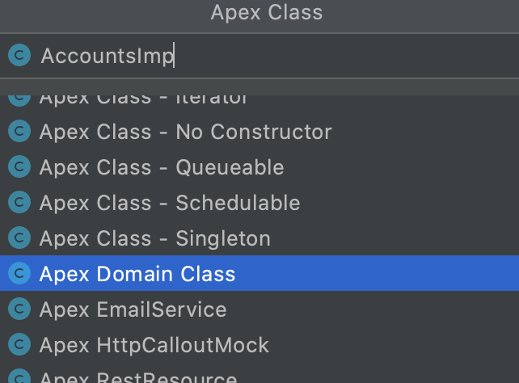
</div>

```apex
public with sharing class AccountsImp extends fflib_SObjectDomain implements Accounts
{
    public AccountsImp(List<Account> records)
    {
        super(records, Schema.Account.SObjectType);
    }
    
    public class Constructor implements fflib_SObjectDomain.IConstructable2
    {
        public fflib_SObjectDomain construct(List<SObject> sObjectList)
        {
            return new AccountsImp(sObjectList);
        }

        public fflib_SObjectDomain construct(List<SObject> sObjectList, SObjectType sObjectType)
        {
            return new AccountsImp(sObjectList);
        }
    }
}
```

Add the missing methods which are defined by the interface.

> :sparkles: Use the Short-Key **CTRL + I**, then select 'Create interface method'

```apex
    public Map<Id, String> getShippingCountryById()
    {
        return null;
    }

    public Set<Id> getRecordIds()
    {
        return null;
    }
```

Now we can write the logic for the methods.
As the logic is quite simple we skip writing another To paragraph.

> :sparkles: Use Live-Template **nm** to create a new map for the returned result

> :sparkles: Use Live-Template **iter** to create loop

```apex
    public Map<Id, String> getShippingCountryById()
    {
        Map<Id, String> result = new Map<Id, String>();
        for (Account record : (List<Account>) getRecords())
        {
            result.put(record.Id, record.ShippingCountry);
        }
        return result;
    }

    public Set<Id> getRecordIds()
    {
        Set<Id> result = new Set<Id>();
        for (Account record : (List<Account>) getRecords())
        {
            result.add(record.Id);
        }
        return result;
    }
```

**Refactor**

Now we can clean up the code a little bit more, 
but removing some duplicated code `(List<Account>) getRecords()`

```apex
    public Map<Id, String> getShippingCountryById()
    {
        Map<Id, String> result = new Map<Id, String>();
        for (Account record : getAccounts())
        {
            result.put(record.Id, record.ShippingCountry);
        }
        return result;
    }

    public Set<Id> getRecordIds()
    {
        Set<Id> result = new Set<Id>();
        for (Account record : getAccounts())
        {
            result.add(record.Id);
        }
        return result;
    }

    public List<Account> getAccounts()
    {
        return (List<Account>) getRecords();
    }
```
### Create Contacts domain implementation
The next failure when trying to deploy the source is the missing domain class for Contacts.
Create a new class named `ContactsImp` based on the "Apex Class - Domain" template,
and implement it from `Contacts`.

<div>
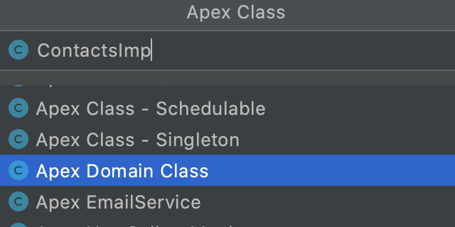
</div>


```apex
public with sharing class ContactsImp extends fflib_SObjectDomain implements Contacts
{
    public ContactsImp(List<Contact> records)
    {
        super(records, Schema.Contact.SObjectType);
    }

    public class Constructor implements fflib_SObjectDomain.IConstructable2
    {
        public fflib_SObjectDomain construct(List<SObject> sObjectList)
        {
            return new ContactsImp(sObjectList);
        }

        public fflib_SObjectDomain construct(List<SObject> sObjectList, SObjectType sObjectType)
        {
            return new ContactsImp(sObjectList);
        }
    }
}
```

Add the missing methods which are defined by the interface.

> :sparkles: Use the Short-Key **CTRL + I**, then select 'Create interface method'

```apex
    public void setMailingCountryByAccountId(Map<Id, String> shippingCountryById)
    {
    }
```

Now we can write the logic for the methods.
As the logic is quite simple we skip writing another To paragraph.

> :sparkles: Use Live-Template **iter** to create loop

> :sparkles: Use Live-Template **if** to create loop

```apex
    public void setMailingCountryByAccountId(Map<Id, String> shippingCountryById)
    {
        for (Contact record : (List<Contact>) getRecords())
        {
            if (shippingCountryById.containsKey(record.AccountId))
            {
                record.MailingCountry = shippingCountryById.get(record.AccountId);                
            }
        }
    }
```

### Create Contacts selector implementation
The final failing issue is the missing implementation for Contacts Selector.
Create a new class named `ContactsSelectorImp` based on the "Apex Class - Selector" template,
and implement it from `ContactsSelector`. 

<div>
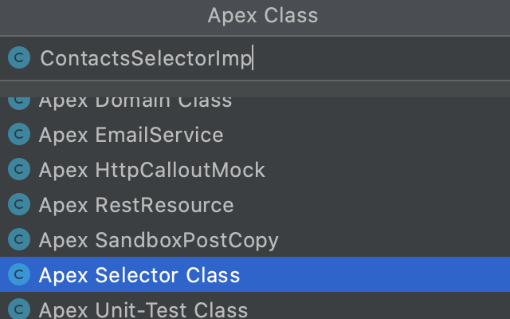
</div>

Add the missing methods which are defined by the interface.

> :sparkles: Use the Short-Key **CTRL + I**, then select 'Create interface method'


### Deploy implementations
Now everything should be deploying successfully to your Scratch Org.

## Add business logic trigger points
The feature test is currently still failing.
We have written our business logic but not defined a point
where it is being executed.

We have to take another look at our GIVEN, WHEN, THEN scenario.
The WHEN part will give guidance on when we need to execute our logic.

>    GIVEN an account with contact records<br/>
>    **WHEN the ShippingCountry is changing on the account record**<br/>
>    THEN the country should be copied to the MailingCountry field on all the child contacts of that account
 
In our story we want to listen to a change on the Account record.
For the purpose of this training we choose to use a standard Trigger,
however a Change Event trigger would have probably made more sense.


### Create Trigger
Let's create a new Trigger for the Accounts object.

<div>
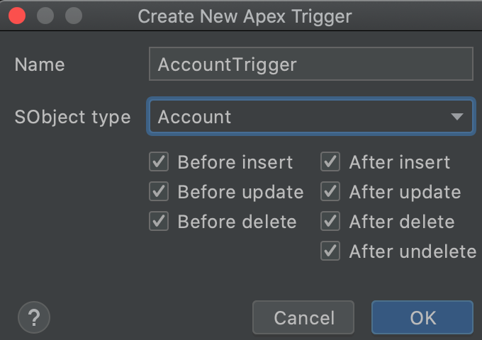
</div>

```apex
trigger AccountTrigger on Account 
		(before insert, before update, before delete, after insert, after update, after delete, after undelete)
{
}
```

Now we need to call the trigger handler from the Apex Enterprise Patterns framework.
The trigger handler is part of the implementation `fflib_SObjectDomain`. 
it should __not__ be considered part of a Domain.
```apex
trigger AccountTrigger on Account 
		(before insert, before update, before delete, after insert, after update, after delete, after undelete)
{
	fflib_SObjectDomain.triggerHandler(AccountsImp.class);
}
```

### Trigger the business logic
Now we need to instruct the trigger handler to execute the business logic.
We extended the `AccountsImp` domain class from `fflib_SObjectDomain`,
which inherits the trigger handler functionality.

Open AccountsImp and implement and override for the method `onAfterUpdate`.

> :sparkles: Use the Short-Key **CTRL + O**, then select 'onAfterUpdate'.

```apex
public override void onAfterUpdate(Map<Id, SObject> existingRecords)
{
}
```

In this method we call our logic, 
and start by pasting the WHEN and THEN part of our user story.
```apex
public override void onAfterUpdate(Map<Id, SObject> existingRecords)
{
  // WHEN the ShippingCountry is changing on the account record
  // THEN the country should be copied to the MailingCountry field on all the child contacts of that account
}
```
Then we translate that into a method call. 
It is better to create a long name than a short name that is not descriptive enough.
```apex
public override void onAfterUpdate(Map<Id, SObject> existingRecords)
{
    onChangedShippingCountryCopyCountryToContactMailingCountry();
}
```

Now create a private local method to trigger our business logic

> :sparkles: Use the Short-Key **ALT + ENTER**, then select 'Create method'.

```apex
private void onChangedShippingCountryCopyCountryToContactMailingCountry()
{
}
```

In this method we first need to look for changed records.
When there are records meeting that condition 
then we execute the business logic for those records.

> :sparkles: Use Live-Template **guard**, to create a guard clause.

```apex
private void onChangedShippingCountryCopyCountryToContactMailingCountry()
{
    List<SObject> changedRecords = getChangedRecords(
            new Set<Schema.SObjectField>
            {
                    Account.ShippingCountry
            }
    );
    
    if (changedRecords.isEmpty()) return;
    
    new AccountsImp(changedRecords).copyCountryToContactMailingCountry();
}
```
We use a guard clause to prevent further execution is there are no records meeting the criteria.
Then we create an instance of the domain with the targeted records,
and execute the logic only for those records via a method invoking  
the business logic `copyCountryToContactMailingCountry`.

```apex
    public void copyCountryToContactMailingCountry()
    {
        ((AccountsService) Application.Service.newInstance(AccountsService.class))
                .copyShippingCountryToContacts(this);        
    }
```
Now we need to resolve the missing reference and clean it up by extracting 
a constant for the AccountsService.

> :sparkles: Use the Short-Key **ALT + CMD + V**, to extract the call to application.

```apex
public with sharing class AccountsImp extends fflib_SObjectDomain implements Accounts
{
    private AccountsService AccountsService = 
            ((AccountsService) Application.Service.newInstance(AccountsService.class));
....

    public void copyCountryToContactMailingCountry()
    {
        AccountsService.copyShippingCountryToContacts(this);        
    }
....
}
```

Next we create a `Service` variable in the `Application` class.

> :sparkles: Use the Short-Key **ALT + ENTER**, to create the variable.

> :sparkles: Use Live-Template **newserf**, to create a new service factory.

```apex
    public static fflib_Application.ServiceFactory Service =
            new fflib_Application.ServiceFactory(
                    new Map<Type, Type>
                    {
                            AccountsService.class => AccountsServiceImp.class
                    }
            );
```

### Execute the feature test and resolve the issues
Keep on executing the feature test and resolve the issues.

> SObject row was retrieved via SOQL without querying the requested field: Contact.AccountId

Open the Contact selector and add the field in the method `getSObjectFieldList`


## Refactoring
When all tests run successfully, we have complete the business requirement of the user story.
**But, we are not done yet!**

We need to go over all the code that we created and review for;
- easy to understand for other developers (or even yourself in a year from now),
- any static code analysis like SonarQube,
- reducing heap-size e.g. lazy loading,
- review execution time and find slow points to improve, optimize SOQL queries etc.


### Refactor - AccountsImp.accountsService
```apex
    private AccountsService accountsService =
            ((AccountsService) Application.Service.newInstance(AccountsService.class));
```
When we review the above code snippet, we see an issues being reported
<div>
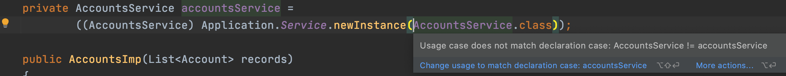
</div>


> :sparkles: Use the Short-Key **F2**, to iterate over all issues reported in the file.

Let's change the variable name into `AccountsService`, 
as this variable represents more like an Object than an actual class variable.

> :sparkles: Use the Short-Key **SHIFT + F6**, to refactor the name and all is usages.

We also want to change this into a lazy loading object, 
as we do not always require to access the service.

> :sparkles: Use Live-Template **prw**, to write `{get; set;}`

> :sparkles: Use Live-Template **lazy**,
>
> :sparkles: Use Live-Template **lazyprw**, to combin lazy design pattern with getter and setter.

```apex
    private AccountsService AccountsService
    {
        get
        {
            if (AccountsService == null)
            {
                AccountsService = 
                        ((AccountsService) Application.Service.newInstance(AccountsService.class));
            }
            return AccountsService;
        }
        private set;
    }
```

### Refactor - AccountsServiceImp.contactsSelector
Do a similar thing for this method as the `AccountsImp.accountsService`


# Resources
Review the folder `IntellJ templates` for Live and File templates 